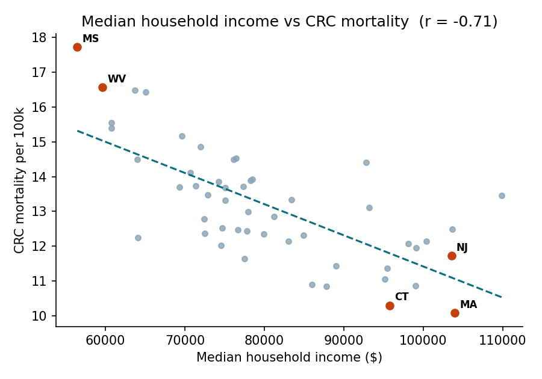
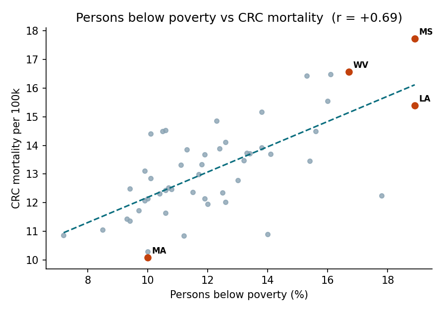
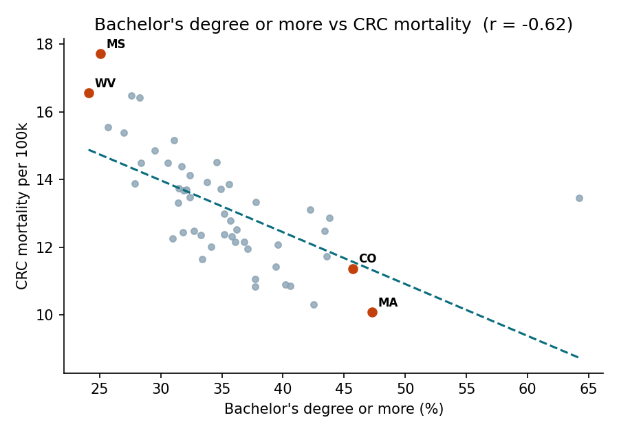
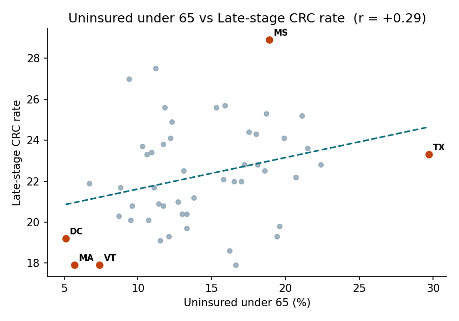
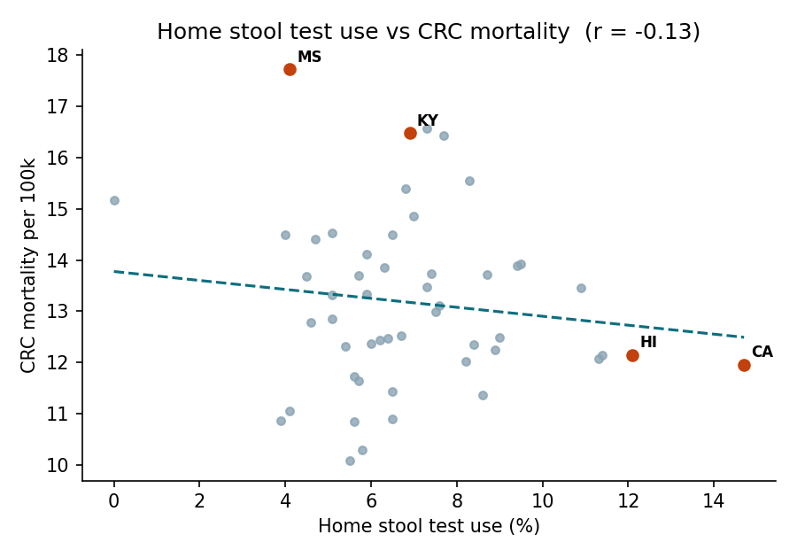
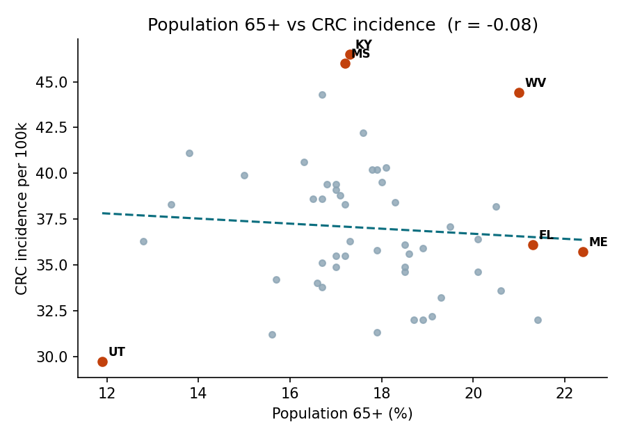

# State-Level Colorectal Cancer Burden and Socioeconomic Factors

How do income, poverty, education, insurance coverage, screening and age structure relate to colorectal cancer (CRC) incidence, mortality and late-stage diagnosis across US states?

**Data:** state-level CRC rates plus socioeconomic indicators (`data/CRC_RESULT.csv`), 50 states + DC.
Puerto Rico is excluded because its mortality is recorded as 0.00, which is missing data.
**Method:** Pearson and Spearman correlations across states, with scatter plots and a linear fit (`analysis.py`).

## Results

| Factor | Outcome | Pearson r | p-value | Verdict |
|---|---|---|---|---|
| Median household income | Mortality | -0.71 | <0.001 | Strong |
| Poverty | Incidence | 0.60 | <0.001 | Strong |
| Poverty | Mortality | 0.69 | <0.001 | Strong |
| Bachelor's degree or more | Mortality | -0.62 | <0.001 | Strong |
| Uninsured under 65 | Late-stage rate | 0.29 | 0.04 | Weak |
| Home stool test use | Mortality | -0.13 | 0.37 | No clear link |
| Population 65+ | Incidence | -0.08 | 0.59 | No clear link |








## Key findings

- **Socioeconomic gradient.** Higher-income, lower-poverty and higher-education states have lower CRC mortality. These three factors overlap heavily, so their effects can't be separated here.
- **Insurance is a modest correlate.** Mississippi has the highest late-stage rate (28.9). Texas has the highest uninsured rate but only a middling late-stage rate (23.3).
- **Home stool test use shows no state-level relationship with mortality.**
- **Age structure doesn't explain state differences in incidence.** Maine, Vermont and Florida are old but have moderate incidence. Relative to the age trend, the largest excess incidence is in Kentucky (+9.4), Mississippi (+8.9), West Virginia (+7.8), Louisiana (+7.1) and Arkansas (+5.2).

## Limitations

These are ecological (state-level) associations with n = 51. They do not show individual-level causation, and the correlations are unadjusted for confounding.

## Run it

```bash
pip install pandas numpy scipy matplotlib
python analysis.py
```
